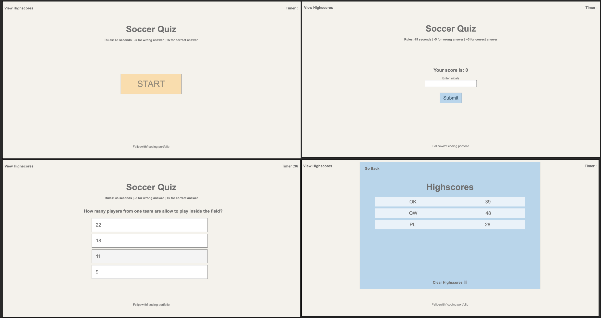
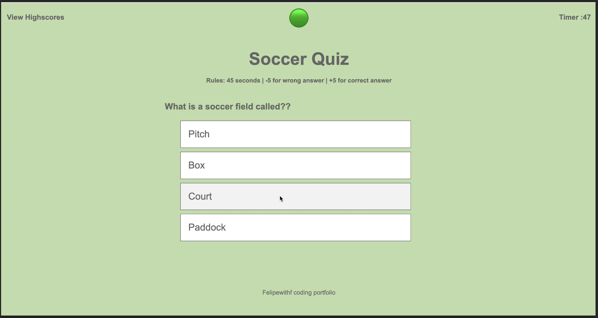
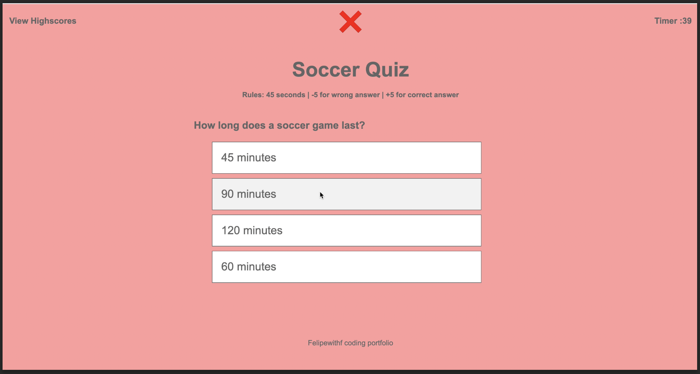
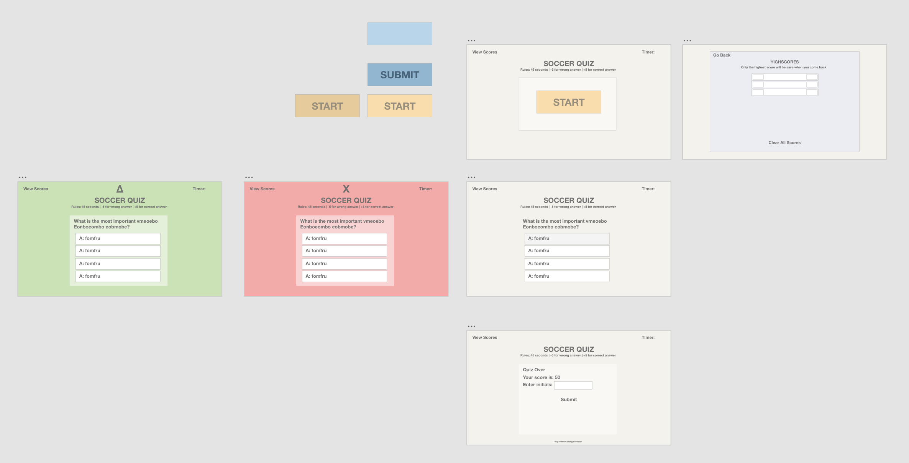

# Soccer Quiz

Try your knowledge with this interactive soccer quiz using HTML, CSS and Javascript

## Description

User is presented with a window that has a title, small rules description and a start button.
When start button is clicked, a timer starts and a question appears. Every answer shows if it is a correct or wrong answer after showing the next question.

If the answer is correct, add time, if the answer is inccorect decrease time, and if the timer reaches 0 the game is over and users score 0.

Player can save the score with their initials, it can save the highscore even if they leave the page or refreshed the page, and they can also delete all scores.

Player can play as many times as they would like.

## Environments
You can view the live demo using this link https://felipewithf.github.io/soccer-quiz/.

## Screenshots

Positive and negative feedback depending of the answer

## UI prototype

using Adobe XD a prototype was created to understand the CSS styling and wireframing

## Tests

Try playing the quiz and achieving a hiegher score everytime!
Also test running out of time, refreshing the screen after a score has been submitted and clikcing view highscores to see it (Localstorage)
Finally try clearing out all scores (event from localstorage) by pressing clear scores from the highscores window

## time estimates

Code structure + questions appearing and dissapearing 
- 2 hr

Code logic for timer, highscores, input form, localstorage.
- 5 hr

Design prototype in XD and CSS wireframe (flex box structure)
- 2 hr

Final CSS style and small animations for wrong and correct inputs
- 4 hr
